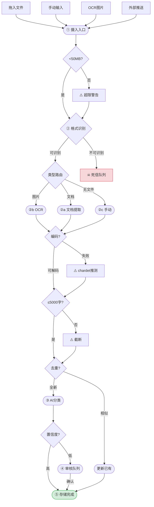
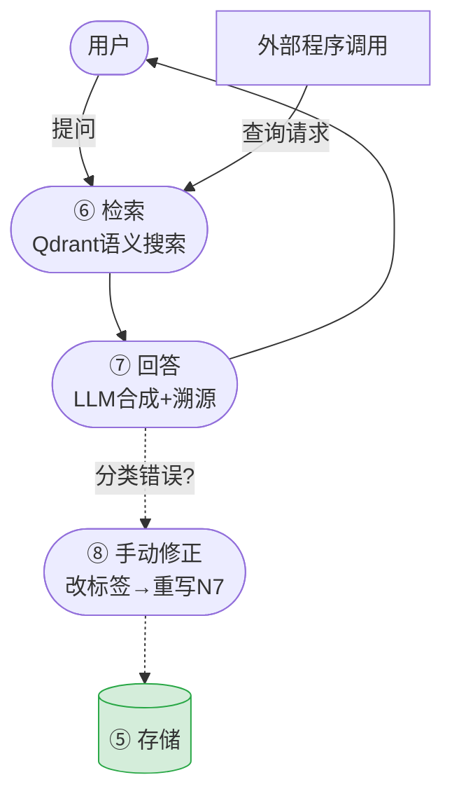
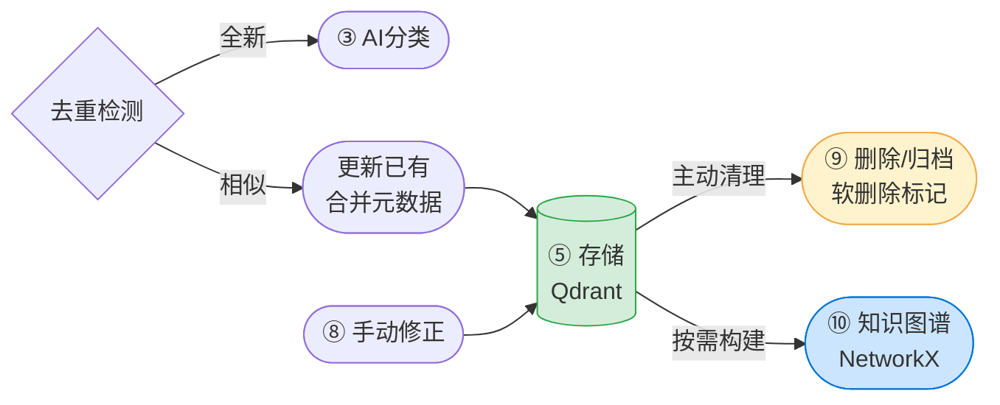
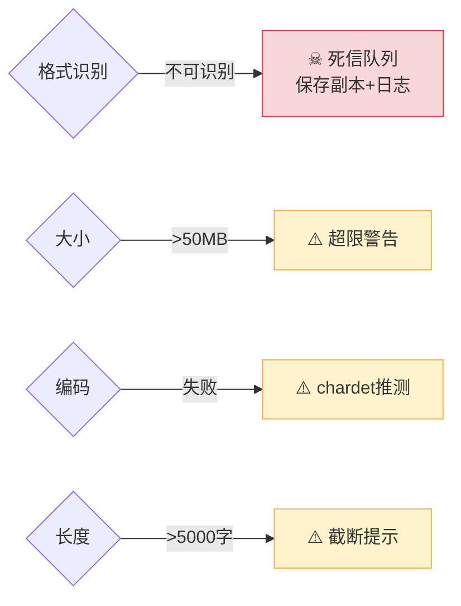

# 流程框图 — Athanor

> 每个 Phase 1 拆解出的任务必须映射到下面某个节点。
> Mermaid 图展示主干的逻辑分支，节点表定义输入/输出/任务。
> 按功能域拆分四张子图，便于移动端阅读。

---

## 总览

```
┌──────────┐    ┌──────────┐    ┌──────────────┐    ┌──────────┐
│  摄 入   │───→│ 知识库   │←───│   搜  索     │    │  其 它   │
│ F1→…→N7  │    │ N7(存储) │    │ N9→N10→User  │    │ DL/W1-3  │
│          │    │ C_DUP    │    │ F6 外部查询  │    │ 系统保障  │
│          │    │ N_UPDATE │    │ N_MANUAL修正 │    │          │
│          │    │ N_DEL    │    │              │    │          │
│          │    │ N_GRAPH  │    │              │    │          │
└──────────┘    └──────────┘    └──────────────┘    └──────────┘
```

---

## 一、摄入流程

> 当前重心。覆盖从"内容进来"到"入库存储"的完整管线。
> 对应节点：F1-F5, N1, C1, N2, C2, N4_*, C3, N5, C_DUP, N_UPDATE, N6, C4, N8, N7



### 摄入节点定义

| 节点 | 名称 | 输入 | 输出 | 逻辑 | 对应任务 |
|:--:|------|------|------|------|:--:|
| F1 | 拖入文件 | 本地文件 | 原始内容 | 用户拖入/选择 | 1h |
| F3 | 手动输入 | 键盘/剪贴板 | 原始内容 | 用户打字 | 1i |
| F4 | OCR图片 | 图片/扫描文档 | 原始图像 | PaddleOCR | — |
| F5 | 外部推送 | Alembic/第三方 | 原始内容+元数据 | API/SDK | v0.7.0 |
| N1 | ① 摄入入口 | 各来源 | 原始内容+来源标注 | 统一入口，标注 source_path | 1a, 1h, 1i |
| C1 | 大小检查 | 原始内容 | 通过/警告 | >50MB 警告但不阻止 | 1g |
| N2 | ② 格式识别 | 原始内容 | 格式/编码/层级 | 16B魔数→扩展名→放弃 | 1a, 1c |
| C2 | 类型路由 | 识别结果 | 分派到提取器 | 图片→OCR, 文档→提取, 无文件→直传 | 1f |
| N4_DOC | ②a 文档提取 | PDF/DOCX/EPUB/HTML/TXT/SRT | 纯文本 | 按格式调用提取器 | 1b, 1c, 1e |
| N4_OCR | ②b OCR提取 | 图片/扫描PDF | 纯文本 | PaddleOCR | — |
| N4_MAN | ②c 手动文本 | 用户输入 | 纯文本 | 直接使用 | 1h |
| C3 | 编码检测 | 字节流 | 解码文本 | UTF-8→GBK→latin-1→chardet | 1d |
| N5 | 文本截断 | 解码文本 | ≤5000字 | 超长截断+提示 | — |
| C_DUP | 去重检测 | 截断文本 | 全新/相似 | 向量相似度>阈值→判重 | v0.5.0 |
| N_UPDATE | 更新已有 | 新文本+旧ID | 合并后向量+元数据 | 保留旧来源，追加新来源 | v0.5.0 |
| N6 | ③ AI分类 | 纯文本 | 分面标签+置信度 | LLM 按分面体系打分 | v0.4.0 |
| C4 | 置信度路由 | 标签+置信度 | 高→入库, 低→审核 | 阈值可配置 | v0.4.5 |
| N8 | ④ 审核队列 | 低置信度结果 | 确认后的标签 | 等待人工确认 | v0.4.5 |
| N7 | ⑤ 存储 | 文本+标签+元数据 | 向量索引+文档注册 | metadata_source + source_path 写入<br/>含预存储钩子（Nigredo 接口），详见 [pre_store_hook_spec.md](docs/pre_store_hook_spec.md) | v0.4.0, v0.7.0(B4) |

### 摄入连线

| 起→止 | 传递内容 | 触发条件 |
|------|------|------|
| N1→C1 | 原始内容 | N1 完成 |
| C1→N2 | 原始内容(≤50MB) | 通过 |
| N2→C2 | 识别结果 | 可识别 |
| N2→DL | 文件+错误日志 | 不可识别 |
| C2→N4_DOC | 识别+文档 | 类型=文档 |
| C2→N4_OCR | 识别+图片 | 类型=图片 |
| C2→N4_MAN | 识别+文本 | 类型=无文件 |
| N4_*→C3 | 提取文本 | 提取完成 |
| C3→N5 | 解码文本 | 编码通过 |
| N5→C_DUP | 截断文本 | 截断完成 |
| C_DUP→N6 | 截断文本 | 去重:全新 |
| C_DUP→N_UPDATE | 新文本+旧ID | 去重:相似 |
| N_UPDATE→N7 | 合并后数据 | 更新完成 |
| N6→C4 | 标签+置信度 | AI分类完成 |
| C4→N7 | 高置信标签 | 置信通过 |
| C4→N8 | 低置信标签 | 置信不足 |
| N8→N7 | 确认标签 | 人工审核完成 |

---

## 二、搜索流程

> 覆盖从"用户提问"到"LLM 回答+溯源"的检索管线。
> 也服务外部程序调用（原则4：工序衔接）。
> 对应节点：F6, N9, N10, N_MANUAL



### 搜索节点定义

| 节点 | 名称 | 输入 | 输出 | 逻辑 | 对应版本 |
|:--:|------|------|------|------|:--:|
| F6 | 外部程序调用 | 下游查询请求 | 检索结果 | 绕过摄入直达 N9 | v0.7.0 |
| N9 | ⑥ 检索 | 用户查询 或 F6 调用 | 相关片段+出处 | Qdrant 语义搜索 | v0.1.0 |
| N10 | ⑦ 回答 | 检索结果+问题 | LLM合成答案+溯源 | 每个论断标注出处 | v0.1.0 |
| N_MANUAL | ⑧ 手动修正 | 用户反馈的错误分类 | 修正标签→写入 N7 | N10 答案中发现问题时纠正 | v0.4.5 |

### 搜索连线

| 起→止 | 传递内容 | 触发条件 |
|------|------|------|
| User→N9 | 查询文本 | 用户提问 |
| F6→N9 | 查询请求 | 外部程序调用 |
| N9→N10 | 相关片段+出处 | 检索完成 |
| N10→User | LLM 合成答案 | 合成完成 |
| N10→N_MANUAL | 错误分类信息 | 用户指出分类/标签不对 |
| N_MANUAL→N7 | 修正标签 | 修正完成 |

---

## 三、知识库管理

> 覆盖知识库的日常维护：去重、更新、删除、图谱。
> 对应节点：C_DUP, N_UPDATE, N_DEL, N_GRAPH, N_MANUAL



### 管理节点定义

| 节点 | 名称 | 触发 | 操作 | 说明 | 对应版本 |
|:--:|------|------|------|------|:--:|
| C_DUP | 去重检测 | 每次摄入 N5 后 | 向量相似度>阈值→判重复 | 防止同内容重复入库 | v0.5.0 |
| N_UPDATE | 更新已有 | C_DUP 判重复 | 合并元数据+来源→重写向量 | 保留旧来源，追加新来源 | v0.5.0 |
| N_MANUAL | ⑧ 手动修正 | 用户从 N10 发现错误 | 修改分面标签→重写 N7 | 修复 AI 分类错误 | v0.4.5 |
| N_DEL | ⑨ 删除/归档 | 用户主动清理 | 软删除(archived)→排除检索 | 不物理删除，保留审计 | v0.5.0 |
| N_GRAPH | ⑩ 知识图谱 | N7 存储后按需触发 | relations→NetworkX→Plotly | 惰性同步: dirty标记→打开时重建 | v0.5.0 |

### 管理连线

| 起→止 | 传递内容 | 触发条件 |
|------|------|------|
| C_DUP→N_UPDATE | 新文本+旧条目ID | 相似度>阈值 |
| N_UPDATE→N7 | 合并后数据 | 更新完成 |
| N7→N_DEL | 目标条目ID | 用户清理 |
| N7→N_GRAPH | 关系数据 | 按需构建 |
| N_MANUAL→N7 | 修正标签 | 修正完成 |

---

## 四、系统保障（其它）

> 错误处理、警告提示、失败兜底。不直接参与主流程，但保证系统不静默失败。
> 对应节点：DL, W1, W2, W3



### 保障节点定义

| 节点 | 名称 | 触发条件 | 处理 | 为什么这样设计 |
|:--:|------|------|------|------|
| DL | 死信队列 | N2 格式不可识别 | 保存副本+错误日志 | 失败不静默，保留原始文件供事后分析 |
| W1 | 超限警告 | 文件>50MB | 警告但仍可继续 | 不阻止用户，但提示性能风险 |
| W2 | 编码失败 | C3 无法解码 | 标注编码失败+chardet推测 | 不丢弃内容，尽力恢复 |
| W3 | 截断提示 | 文本>5000字 | 截断+提示用户 | LLM 上下文窗口有限，MVP 阶段暂不处理长文本切分 |

### 保障连线

| 起→止 | 传递内容 | 触发条件 |
|------|------|------|
| N2→DL | 原始文件+错误信息 | 格式无法识别 |
| C1→W1 | 原始内容+大小信息 | >50MB |
| C3→W2 | 标注信息+推测编码 | 编码检测失败 |
| N5→W3 | 截断文本+提示 | >5000字 |

---

*版本: v3 | 最后更新: 2026-06-17*

*变更记录:*
- v3: 按功能域拆分为四张独立子图（摄入/搜索/知识库管理/系统保障），每张自含节点定义+连线表。总览图改为文本框图。
- v2: 新增 6 个节点 — F6, C_DUP, N_UPDATE, N_MANUAL, N_DEL, N_GRAPH。
- v1: 初始版本。

*当前重心：一、摄入流程（N1→N2→提取）。*
