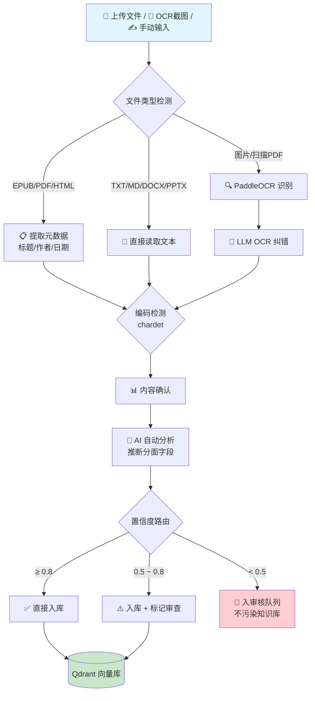
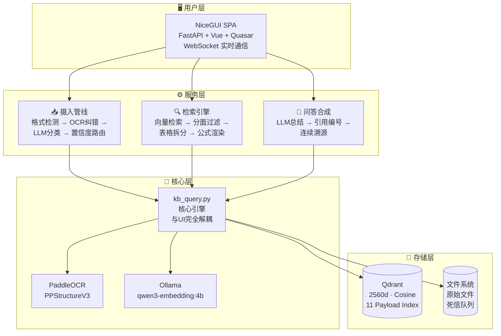
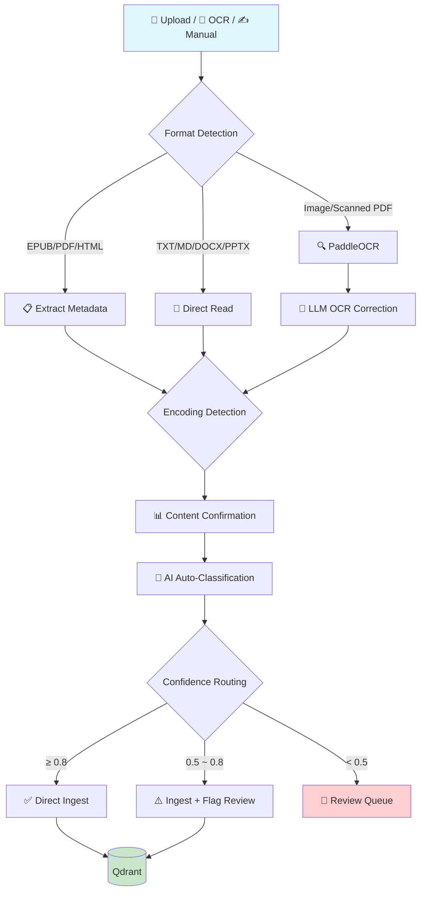
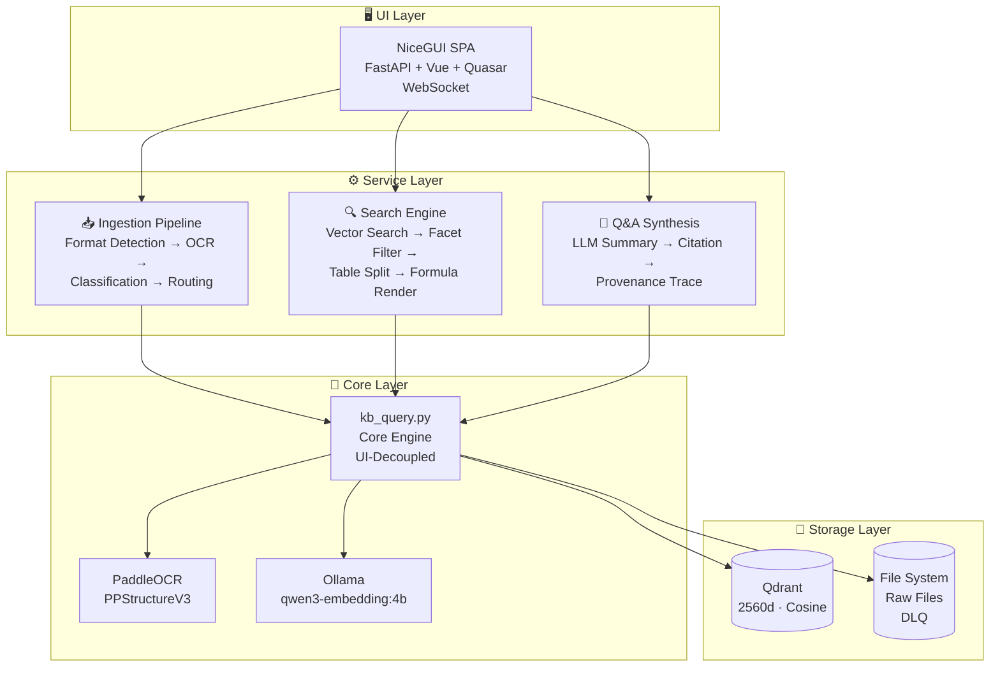

<p align="center">
  
</p>

<h1 align="center">Athanor · 熔知 / MindForge</h1>

<p align="center">
  <b>个人本地知识引擎</b><br>
  把截图、手册、笔记丢进去，问一个问题，直接得到<strong>带来源引用的答案</strong>。<br>
  数据全在本地，不联网也能用。
</p>

<p align="center">
  <a href="https://github.com/shiyao222333-afk/athanor"></a>
  <a href="https://github.com/shiyao222333-afk/athanor/blob/main/LICENSE"></a>
  
  <a href="https://github.com/shiyao222333-afk/athanor/stargazers"></a>
</p>

<p align="center">
  <b>🌐 Language:</b> &nbsp;
  <a href="#cn">🇨🇳 中文</a> &nbsp;|&nbsp;
  <a href="#en">🇬🇧 English</a>
</p>

<p align="center">
  <a href="#-为什么需要-athanor"><b>🤔 为什么需要</b></a> ·
  <a href="#-核心亮点"><b>✨ 核心亮点</b></a> ·
  <a href="#-竞品对比"><b>🆚 竞品对比</b></a> ·
  <a href="#-操作流程"><b>🔄 操作流程</b></a> ·
  <a href="#-架构概览"><b>🏗️ 架构概览</b></a> ·
  <a href="#-路线图"><b>🗺️ 路线图</b></a> ·
  <a href="#-快速开始"><b>⚡ 快速开始</b></a> ·
  <a href="https://github.com/shiyao222333-afk/athanor/issues"><b>🐛 提 Issue</b></a>
</p>

---

<!-- ============================================================ -->
<!--                        CN VERSION                            -->
<!-- ============================================================ -->

<span id="cn"></span>

## 🤔 为什么需要 Athanor？

> **"有问题直接问 LLM（GPT/DeepSeek）不就行了，为什么要手动输入知识？"**

这是最重要的问题。答案一句话：

> **LLM 是「聪明的外人」，Athanor 是「读过你所有资料的私人助理」。**

| 问题 | 直接问 LLM | 用 Athanor |
|------|-----------|-------------------|
| 没有你的私有知识 | ❌ 它没读过 | ✅ 直接搜你本地资料 |
| 没有记忆 | ❌ 每次对话都是新的 | ✅ 越用越强 |
| 无法溯源 | ❌ 答案不知道从哪来 | ✅ 每个答案带 `[引用N]` |
| 数据隐私 | ❌ 上传云端 | ✅ 全本地运行 |

---

## ⚡ 3 秒快速体验

```bash
# 1. 克隆项目
git clone https://github.com/shiyao222333-afk/athanor.git && cd athanor

# 2. 安装依赖
pip install -r requirements.txt

# 3. 启动
python run.py
# → 浏览器访问 http://localhost:8080
# → 跟着向导建库 → 上传文件 → 开始提问！
```

> 💡 需要有 LLM API Key（DeepSeek / 通义千问 等均可），在「引擎配置」页面一键填写。入门指南见 [START.md](START.md)。

---

## ✨ 核心亮点

Athanor 的核心差异化能力，按三大功能域组织：

### 📥 摄入 — 不只是上传文件，是理解文件

| # | 亮点 | 一句话说明 |
|---|------|-----------|
| 1 | **两阶段摄入管线 + LLM 自动分类** | 先确认内容再 AI 分析，LLM 通过四层管道（模板→元数据→关键词→LLM推断）自动推断分面字段，用户只需确认或微调。 [→ FPF 认知层级 (arxiv 2601.21116)](docs/schema.md#分面4认知验证状态-epistemic_status必填) |
| 2 | **8 格式智能检测 + 三档置信度路由** | 自动识别 EPUB/PDF/DOCX/PPTX/HTML/SRT 等格式并提取元数据；AI 分析结果按置信度三档路由：≥0.8 直通入库、0.5-0.8 入库标记审查、<0.5 进入审核队列不污染知识库。 [→ chardet 编码自检链](PROJECT_PLAN.md#v045-计划--智能摄入深化-) |
| 3 | **OCR 深度优化 + 死信队列** | PaddleOCR + PPStructureV3 识别中英文/表格/公式，LLM 二次纠错 OCR 错别字；解析失败的文件进入 Dead Letter Queue 保留现场，不影响知识库纯净度。 [→ PaddleOCR + PPStructureV3](https://github.com/PaddlePaddle/PaddleOCR) |

### 🔍 搜索 — 不是关键词匹配，是精确溯源

| # | 亮点 | 一句话说明 |
|---|------|-----------|
| 4 | **表格行级拆分 + 连续引用编号** | 大表格按行切块，每行独立检索，引用精确到单元格；`[引用1][引用2]` 连续不跳跃，点击直达原文位置。 |
| 5 | **KaTeX 服务端公式渲染** | PPStructureV3 识别公式结构 → KaTeX 服务端渲染为矢量图 → 搜索结果中嵌入可缩放公式，杜绝模糊。 [→ KaTeX](https://github.com/KaTeX/KaTeX) |

### 🗂️ 知识组织 — 不是文件夹，是结构化认知

| # | 亮点 | 一句话说明 |
|---|------|-----------|
| 6 | **分面分类 v5.0** | 基于 UDC 国际十进分类法 + FPF 认知层级理论，4 维度精确标注每条知识：content_type (15种) × domain (UDC 9主类) × temporal_nature (3级时效) × epistemic_status (L0-L2 验证层级)。 [→ UDC 国际十进分类法](https://www.udcsummary.info/) · [→ FPF (arxiv 2601.21116)](docs/schema.md#分面4认知验证状态-epistemic_status必填) |
| 7 | **全本地运行** | Qdrant 向量库 + Ollama 本地嵌入模型 (qwen3-embedding:4b) + 可选本地 LLM，数据不出机器，隐私零风险。可完全离线运行（需本地 LLM）。 |
| 8 | **NiceGUI SPA 单页应用** | FastAPI + Vue + Quasar + WebSocket，毫秒级页面切换，纯 Python 全栈开发，零前端依赖。 [→ NiceGUI](https://nicegui.io/) |

> 📘 各类亮点的学术/技术依据详见 [docs/schema.md](docs/schema.md)（字段设计）、[PROJECT_PLAN.md](PROJECT_PLAN.md)（版本路线图）、[CHANGELOG.md](CHANGELOG.md)（变更日志）。

---

## 🆚 竞品对比

Athanor 与主流本地知识库/RAG 工具的功能逐一对比：

| 功能维度 | Athanor | RAGFlow<br><sub>37k⭐</sub> | AnythingLLM<br><sub>30k⭐</sub> | Dify<br><sub>60k⭐</sub> | FastGPT<br><sub>20k⭐</sub> |
|----------|:-------:|:-------:|:-------:|:----:|:-------:|
| **摄入** | | | | | |
| OCR 中文识别 | ✅ PaddleOCR | ✅ | ❌ | ❌ | ❌ |
| 公式识别+渲染 | ✅ KaTeX | ✅ | ❌ | ❌ | ❌ |
| LLM 自动分类 | ✅ 四层管道 | ❌ | ❌ | ❌ | ❌ |
| 多格式检测 | ✅ 8种 | ✅ | ✅ | ✅ | ✅ |
| 置信度路由 | ✅ 三档 | ❌ | ❌ | ❌ | ❌ |
| 死信队列 | ✅ | ❌ | ❌ | ❌ | ❌ |
| **搜索** | | | | | |
| 表格行级拆分 | ✅ | ❌ | ❌ | ❌ | ❌ |
| 连续引用编号 | ✅ | ❌ | ❌ | ❌ | ❌ |
| 引用点击溯源 | ✅ | ✅ | ✅ | ✅ | ✅ |
| **知识组织** | | | | | |
| 分面分类 | ✅ v5.0 | ❌ | ❌ | ❌ | ❌ |
| 认知验证层级 | ✅ L0-L2 | ❌ | ❌ | ❌ | ❌ |
| 通用关系字段 | ✅ 8种关系 | ❌ | ❌ | ❌ | ❌ |
| **架构** | | | | | |
| 全本地运行 | ✅ | ✅ | ✅ | ✅ | ✅ |
| SPA Web UI | ✅ NiceGUI | ✅ | ✅ | ✅ | ✅ |
| 部署难度 | 低 (pip) | 中 (Docker) | 低 | 高 (Docker+DB) | 中 (Docker) |
| 开源协议 | MIT | Apache 2.0 | MIT | Apache 2.0 | MIT |

> **选择建议**：
> - 需要处理**中文技术文档、公式、表格**，且要求**精细分类和溯源** → **Athanor**
> - 需要企业级 RAG 引擎 + 完整 Web UI → RAGFlow / Dify
> - 需要简单桌面应用快速聊天 → AnythingLLM
> - 需要快速搭建知识库问答系统 → FastGPT

---

## 🔄 操作流程

### 摄入管线



### 搜索问答


---

## 🏗️ 架构概览



**技术栈一览：**

| 层 | 技术 | 说明 |
|----|------|------|
| 向量数据库 | [Qdrant](https://github.com/qdrant/qdrant) | 2560d, Cosine 距离, 单集合 `athanor_v1` |
| 嵌入模型 | [Ollama](https://github.com/ollama/ollama) + `qwen3-embedding:4b` | 本地推理，中英文兼顾 |
| OCR 引擎 | [PaddleOCR](https://github.com/PaddlePaddle/PaddleOCR) / PPStructureV3 | 中文优化，表格+公式识别 |
| LLM 合成 | OpenAI 兼容 API（默认 DeepSeek） | 可切换通义千问/本地模型 |
| 公式渲染 | [KaTeX](https://github.com/KaTeX/KaTeX) | 服务端渲染，矢量输出 |
| Web UI | [NiceGUI](https://nicegui.io) 3.13 | SPA, FastAPI + Vue + Quasar + WebSocket |
| 编码检测 | [chardet](https://github.com/chardet/chardet) | UTF-8 → GBK → latin-1 兜底链 |

---

## 🗺️ 路线图

| 版本 | 状态 | 代号 | 核心交付 |
|------|:----:|------|---------|
| v0.1.0 | ✅ | 核心引擎 | CLI 向量搜索 + LLM 问答 + OCR + KaTeX + 表格拆分 |
| v0.2.0 | ✅ | Web UI MVP | 4 页面（摄入/检索/管理/配置）+ 首次建库向导 |
| v0.3.0 | ✅ | 分面分类 v4.0 | 36 字段分组方案 + 关系管理 + 分面统计仪表盘 |
| v0.4.0 | ✅ | 智能摄入 | LLM 自动分类 + 两阶段摄入管线 |
| v0.4.1 | ✅ | 分面分类 v5.0 | UDC 9 主类 + NiceGUI SPA 迁移 |
| v0.4.5 | 🚧 | 智能摄入深化 | 8 格式检测 + 死信队列 + 置信度路由 |
| v0.5.0 | 🔮 | 守望文件夹 | 文件夹监听自动摄入 + 批量处理 |
| v1.0.0 | 🔮 | 生产就绪 | 移动端适配 + 微信 Bot + 知识图谱 |

> 详细路线图见 [PROJECT_PLAN.md](PROJECT_PLAN.md)

---

## ⚙️ 快速开始

### 环境准备

```bash
# Python >= 3.13
# Ollama（嵌入模型运行环境）从 https://ollama.com 安装

# 拉取嵌入模型
ollama pull qwen3-embedding:4b
```

### 安装 & 启动

```bash
pip install nicegui requests qdrant-client \
            paddlepaddle paddleocr "paddlex[ocr]==3.7.0" \
            fpdf2 pillow matplotlib

# 启动
python run.py
# → 浏览器访问 http://localhost:8080
```

### 使用流程

1. **首次使用** → 自动弹出建库向导 → 选择嵌入模型 → 创建集合
2. **摄入资料** →「文档注入」页面上传文件或 OCR 截图
3. **搜索问答** →「智能检索」页面输入问题，勾选是否启用 AI 问答
4. **管理知识** →「知识中枢」页面查看统计、审核队列、导出数据

> 📘 详细指南：[START.md](START.md)

---

## 👤 适合谁用？

| ✅ 非常适合 | ❌ 不太适合 |
|------------|------------|
| 有中文技术文档/手册积累的人 | 数据量极小（<10 个文件）且不需要搜索 |
| 截图/照片里有大量文字需要检索 | 想要商业化完整 Web UI（我们还在迭代） |
| 关心数据隐私，不想上传云端 | 不想碰任何配置（首次需 2 分钟） |
| 需要精确溯源：答案从哪张图/哪份文档来 | |
| 公式/表格很多的技术文档 | |
| 小说作者（世界观设定管理） | |
| 学术研究者（论文/标准文档管理） | |

---

## ❓ FAQ

**Q：支持英文文档吗？**
A：支持。`qwen3-embedding:4b` 对中英文都有效果。英文场景可换 `nomic-embed-text`。

**Q：能处理多少数据？**
A：理论上无上限，受限于硬件。Qdrant 支持磁盘存储。建议先从小批量（几十个文件）开始。

**Q：和 Obsidian / Notion 有什么区别？**
A：Obsidian 是笔记管理，Notion 是在线协作。Athanor 专注**非结构化资料**（截图、扫描件、PDF）的**语义搜索和问答**。

**Q：需要联网吗？**
A：摄入和向量检索不需要联网。仅 LLM 合成回答时需联网（可切换本地 LLM 完全离线）。

**Q：和 RAGFlow / Dify 的定位差异？**
A：RAGFlow/Dify 是面向企业的 RAG 引擎平台，Athanor 是面向个人的知识引擎——更轻量（pip 直接装）、更深入（表格行级拆分、分面分类、认知验证层级）、更聚焦个人场景。

---

## 🤝 贡献

欢迎参与！项目处于活跃开发阶段，每一份贡献都能显著影响方向。

- 🐛 **报告 Bug**：[提交 Issue](https://github.com/shiyao222333-afk/athanor/issues/new)
- 💡 **功能请求**：[功能请求](https://github.com/shiyao222333-afk/athanor/issues/new?template=feature)
- 💻 **代码贡献**：Fork → 分支 → PR

---

## 📄 许可证

[MIT License](LICENSE) — 自由使用、修改和分发。

---

## 🙏 致谢

- [Qdrant](https://github.com/qdrant/qdrant) — 高性能向量数据库
- [Ollama](https://github.com/ollama/ollama) — 本地 LLM 运行环境
- [NiceGUI](https://nicegui.io) — Python SPA 框架
- [PaddleOCR](https://github.com/PaddlePaddle/PaddleOCR) — 中文 OCR 引擎
- [KaTeX](https://github.com/KaTeX/KaTeX) — 公式渲染引擎
- [UDC](https://www.udcsummary.info/) — 国际十进分类法
- Gilda & Lamb (2026) — FPF 第一性原理框架 ([arxiv 2601.21116](https://arxiv.org/abs/2601.21116))

---

<!-- ============================================================ -->
<!--                        EN VERSION                            -->
<!-- ============================================================ -->

<span id="en"></span>

# 🇬🇧 Athanor · 熔知 / MindForge

<p align="center">
  <b>Personal Local Knowledge Engine</b><br>
  Drop in screenshots, manuals, and notes. Ask a question. Get <strong>answers with source citations</strong>.<br>
  All data stays local. Works offline.
</p>

---

## 🤔 Why Athanor?

> **"Why not just ask an LLM (GPT/DeepSeek) directly? Why manually input knowledge?"**

The answer in one line:

> **An LLM is a "smart stranger." Athanor is a "personal assistant that has read everything you own."**

| Problem | Direct LLM | Athanor |
|---------|-----------|---------|
| No access to your private knowledge | ❌ Never read it | ✅ Searches your local files |
| No memory | ❌ Each chat starts fresh | ✅ Gets smarter over time |
| No traceability | ❌ Can't tell where answers come from | ✅ Every answer cites `[refN]` |
| Data privacy | ❌ Uploaded to cloud | ✅ Fully local |

---

## ⚡ Quick Start

```bash
git clone https://github.com/shiyao222333-afk/athanor.git && cd athanor
pip install -r requirements.txt
python run.py
# → Open http://localhost:8080
# → Follow the wizard to create a collection → Upload files → Ask questions!
```

> 💡 Requires an LLM API Key (DeepSeek, Qwen, etc.). Configure in the Engine Settings page. See [START.md](START.md) for details.

---

## ✨ Core Highlights

Athanor's key differentiators, organized by functional domain:

### 📥 Ingestion — Not just uploading files, but understanding them

| # | Highlight | One-liner |
|---|-----------|-----------|
| 1 | **Two-phase ingestion + LLM auto-classification** | Confirm content first, then AI analyzes it. LLM infers facet fields through a 4-layer pipeline (template → metadata → keyword → LLM inference). Users only need to confirm or tweak. [→ FPF Epistemic Levels (arxiv 2601.21116)](docs/schema.md) |
| 2 | **8-format smart detection + 3-tier confidence routing** | Auto-detect EPUB/PDF/DOCX/PPTX/HTML/SRT and extract metadata. AI results routed by confidence: ≥0.8 straight to DB; 0.5–0.8 stored with review flag; <0.5 goes to review queue — never pollutes the knowledge base. [→ chardet encoding chain](PROJECT_PLAN.md) |
| 3 | **Deep OCR optimization + Dead Letter Queue** | PaddleOCR + PPStructureV3 for Chinese/English/tables/formulas. LLM post-corrects OCR typos. Failed parses enter the Dead Letter Queue for inspection without contaminating the KB. [→ PaddleOCR](https://github.com/PaddlePaddle/PaddleOCR) |

### 🔍 Search — Not keyword matching, but precise provenance

| # | Highlight | One-liner |
|---|-----------|-----------|
| 4 | **Row-level table splitting + consecutive citation numbering** | Large tables split by row for independent retrieval, citations precise to the cell. `[ref1][ref2]` numbered consecutively without gaps, clickable to source. |
| 5 | **KaTeX server-side formula rendering** | PPStructureV3 extracts formula structure → KaTeX server-renders as vector graphics → embeddable, scalable formulas in search results. [→ KaTeX](https://github.com/KaTeX/KaTeX) |

### 🗂️ Knowledge Organization — Not folders, but structured cognition

| # | Highlight | One-liner |
|---|-----------|-----------|
| 6 | **Faceted Classification v5.0** | Based on UDC (Universal Decimal Classification) + FPF epistemic hierarchy. 4 dimensions per entry: content_type (15 types) × domain (UDC 9 main classes) × temporal_nature (3 tiers) × epistemic_status (L0–L2 verification levels). [→ UDC](https://www.udcsummary.info/) · [→ FPF (arxiv 2601.21116)](docs/schema.md) |
| 7 | **Fully local execution** | Qdrant vector DB + Ollama local embeddings (qwen3-embedding:4b) + optional local LLM. Data never leaves your machine. Can run completely offline. |
| 8 | **NiceGUI SPA** | FastAPI + Vue + Quasar + WebSocket. Instant page switches, pure Python full-stack, zero frontend dependencies. [→ NiceGUI](https://nicegui.io/) |

> 📘 See [docs/schema.md](docs/schema.md) (field design), [PROJECT_PLAN.md](PROJECT_PLAN.md) (roadmap), and [CHANGELOG.md](CHANGELOG.md) (changelog) for academic and technical references.

---

## 🆚 Feature Comparison

Feature-by-feature comparison with major local KB / RAG tools:

| Feature | Athanor | RAGFlow<br><sub>37k⭐</sub> | AnythingLLM<br><sub>30k⭐</sub> | Dify<br><sub>60k⭐</sub> | FastGPT<br><sub>20k⭐</sub> |
|---------|:-------:|:-------:|:-------:|:----:|:-------:|
| **Ingestion** | | | | | |
| Chinese OCR | ✅ PaddleOCR | ✅ | ❌ | ❌ | ❌ |
| Formula recognition + rendering | ✅ KaTeX | ✅ | ❌ | ❌ | ❌ |
| LLM auto-classification | ✅ 4-layer pipeline | ❌ | ❌ | ❌ | ❌ |
| Multi-format detection | ✅ 8 formats | ✅ | ✅ | ✅ | ✅ |
| Confidence routing | ✅ 3-tier | ❌ | ❌ | ❌ | ❌ |
| Dead Letter Queue | ✅ | ❌ | ❌ | ❌ | ❌ |
| **Search** | | | | | |
| Row-level table splitting | ✅ | ❌ | ❌ | ❌ | ❌ |
| Consecutive citation numbering | ✅ | ❌ | ❌ | ❌ | ❌ |
| Clickable citation traceability | ✅ | ✅ | ✅ | ✅ | ✅ |
| **Knowledge Organization** | | | | | |
| Faceted classification | ✅ v5.0 | ❌ | ❌ | ❌ | ❌ |
| Epistemic verification levels | ✅ L0–L2 | ❌ | ❌ | ❌ | ❌ |
| Universal relation fields | ✅ 8 types | ❌ | ❌ | ❌ | ❌ |
| **Architecture** | | | | | |
| Fully local | ✅ | ✅ | ✅ | ✅ | ✅ |
| SPA Web UI | ✅ NiceGUI | ✅ | ✅ | ✅ | ✅ |
| Deployment complexity | Low (pip) | Medium (Docker) | Low | High (Docker+DB) | Medium (Docker) |
| License | MIT | Apache 2.0 | MIT | Apache 2.0 | MIT |

> **Recommendation**:
> - Need **Chinese technical docs, formulas, tables** with **fine-grained classification and provenance** → **Athanor**
> - Need enterprise RAG engine + full Web UI → RAGFlow / Dify
> - Need simple desktop chat app → AnythingLLM
> - Need quick KB Q&A setup → FastGPT

---

## 🔄 Workflow

### Ingestion Pipeline



### Search & Q&A


---

## 🏗️ Architecture



**Tech Stack:**

| Layer | Technology | Notes |
|-------|-----------|-------|
| Vector DB | [Qdrant](https://github.com/qdrant/qdrant) | 2560d, Cosine, single collection `athanor_v1` |
| Embeddings | [Ollama](https://github.com/ollama/ollama) + `qwen3-embedding:4b` | Local inference, bilingual |
| OCR | [PaddleOCR](https://github.com/PaddlePaddle/PaddleOCR) / PPStructureV3 | Chinese-optimized, table + formula recognition |
| LLM | OpenAI-compatible API (default DeepSeek) | Swappable (Qwen, local models) |
| Formula | [KaTeX](https://github.com/KaTeX/KaTeX) | Server-side rendering, vector output |
| Web UI | [NiceGUI](https://nicegui.io) 3.13 | SPA, FastAPI + Vue + Quasar + WebSocket |
| Encoding | [chardet](https://github.com/chardet/chardet) | UTF-8 → GBK → latin-1 fallback chain |

---

## 🗺️ Roadmap

| Version | Status | Codename | Key Deliverables |
|---------|:------:|----------|------------------|
| v0.1.0 | ✅ | Core Engine | CLI vector search + LLM Q&A + OCR + KaTeX + table splitting |
| v0.2.0 | ✅ | Web UI MVP | 4 pages (ingest/search/manage/config) + collection wizard |
| v0.3.0 | ✅ | Faceted Classification v4.0 | 36-field grouped schema + relations + facet stats dashboard |
| v0.4.0 | ✅ | Smart Ingestion | LLM auto-classification + two-phase ingestion pipeline |
| v0.4.1 | ✅ | Faceted Classification v5.0 | UDC 9 main classes + NiceGUI SPA migration |
| v0.4.5 | 🚧 | Deep Ingestion | 8-format detection + Dead Letter Queue + confidence routing |
| v0.5.0 | 🔮 | Watch Folder | Folder monitoring + auto-ingestion + batch processing |
| v1.0.0 | 🔮 | Production Ready | Mobile adaptation + WeChat Bot + knowledge graph |

> Full roadmap: [PROJECT_PLAN.md](PROJECT_PLAN.md)

---

## ⚙️ Setup

```bash
# Prerequisites
# Python >= 3.13, Ollama from https://ollama.com
ollama pull qwen3-embedding:4b

# Install & Run
pip install nicegui requests qdrant-client \
            paddlepaddle paddleocr "paddlex[ocr]==3.7.0" \
            fpdf2 pillow matplotlib
python run.py
# → http://localhost:8080
```

**Usage:**
1. **First launch** → Collection wizard pops up → select embedding model → create collection
2. **Ingest** → "Document Ingestion" page → upload files or OCR screenshots
3. **Search** → "Smart Search" page → type query, toggle AI synthesis
4. **Manage** → "Knowledge Hub" page → stats, review queue, export

> 📘 Detailed guide: [START.md](START.md)

---

## 👤 Who Is This For?

| ✅ Great fit | ❌ Not a great fit |
|-------------|-------------------|
| People with Chinese technical docs/manuals | Tiny datasets (<10 files) with no search needs |
| Lots of text trapped in screenshots/photos | Want a polished commercial Web UI (we're iterating) |
| Privacy-conscious, don't want cloud upload | Don't want any config (first setup takes 2 min) |
| Need precise provenance: which doc/page did this come from? | |
| Technical docs heavy on formulas and tables | |
| Fiction authors (worldbuilding knowledge management) | |
| Academic researchers (paper/standard management) | |

---

## ❓ FAQ

**Q: Does it support English documents?**
A: Yes. `qwen3-embedding:4b` works well for both Chinese and English. For English-only, switch to `nomic-embed-text`.

**Q: How much data can it handle?**
A: Theoretically unlimited, bounded by hardware. Qdrant supports disk storage. Start with small batches (a few dozen files).

**Q: How is it different from Obsidian / Notion?**
A: Obsidian is note management; Notion is online collaboration. Athanor focuses on **semantic search and Q&A over unstructured materials** (screenshots, scans, PDFs).

**Q: Does it need internet?**
A: Ingestion and vector search work offline. Only LLM synthesis needs internet (switch to a local LLM for full offline operation).

**Q: How does it differ from RAGFlow / Dify?**
A: RAGFlow/Dify are enterprise RAG platforms. Athanor is a personal knowledge engine — lighter (pip install), deeper (row-level table splitting, faceted classification, epistemic verification levels), and focused on individual use cases.

---

## 🤝 Contributing

Contributions welcome! The project is in active development — every contribution shapes its direction.

- 🐛 **Bug Report**: [Open an Issue](https://github.com/shiyao222333-afk/athanor/issues/new)
- 💡 **Feature Request**: [Feature Request](https://github.com/shiyao222333-afk/athanor/issues/new?template=feature)
- 💻 **Code**: Fork → Branch → PR

---

## 📄 License

[MIT License](LICENSE) — Free to use, modify, and distribute.

---

## 🙏 Acknowledgments

- [Qdrant](https://github.com/qdrant/qdrant) — High-performance vector database
- [Ollama](https://github.com/ollama/ollama) — Local LLM runtime
- [NiceGUI](https://nicegui.io) — Python SPA framework
- [PaddleOCR](https://github.com/PaddlePaddle/PaddleOCR) — Chinese OCR engine
- [KaTeX](https://github.com/KaTeX/KaTeX) — Formula rendering engine
- [UDC](https://www.udcsummary.info/) — Universal Decimal Classification
- Gilda & Lamb (2026) — FPF First-Principles Framework ([arxiv 2601.21116](https://arxiv.org/abs/2601.21116))

---

<p align="center">
  <a href="#cn">🇨🇳 Back to 中文</a> &nbsp;|&nbsp;
  <a href="#en">🇬🇧 Back to Top</a>
</p>

<p align="center">
  ⭐ If this direction resonates with you, please give it a Star!<br>
  🗂️ Turn your accumulated knowledge into real assets.
</p>

<p align="center">
  
</p>
